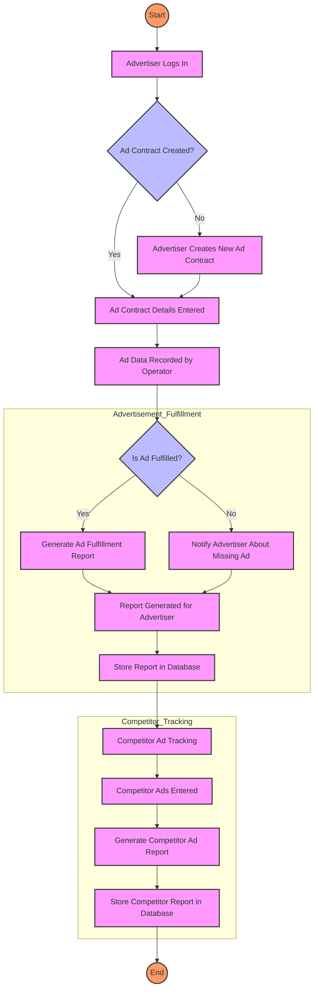

# ad-monitor

# SaaS for Advertisement Tracking

This SaaS application is designed to solve two critical problems for advertisers:

1. **Ensuring Ad Contract Fulfillment**: Advertisers can verify whether their ads are aired or displayed according to the terms of their contracts (e.g., TV airtime, radio slots, or billboard/panel displays).
2. **Competitor Ad Tracking**: Advertisers can gain insights into competitors' advertisements and strategies by purchasing data about their ad campaigns.

## Features

- **Advertiser Management**: Add, update, delete, and retrieve advertiser details.
- **Ad Contracts**: Manage contracts for ads on TV, radio, and panels.
- **Ad Tracking**: Record and analyze data to verify contract fulfillment and track competitors' ads.
- **Reporting**: Generate detailed reports on contract fulfillment and competitor ad activity.
- **Operator Actions**: Log operator actions to ensure accountability and traceability.

## API Endpoints

### Advertiser Management

- **POST /advertisers**: Create a new advertiser.
- **GET /advertisers**: Retrieve all advertisers.
- **GET /advertisers/:id**: Retrieve a specific advertiser.
- **PUT /advertisers/:id**: Update advertiser details.
- **DELETE /advertisers/:id**: Delete an advertiser.

### Ad Contracts

- **POST /ad-contracts**: Create a new ad contract.
- **GET /ad-contracts**: Retrieve all ad contracts.
- **GET /ad-contracts/:id**: Retrieve a specific ad contract.
- **PUT /ad-contracts/:id**: Update an ad contract.
- **DELETE /ad-contracts/:id**: Delete an ad contract.

### Ad Tracking

- **POST /ad-tracking**: Record tracking data for an ad.
- **GET /ad-tracking**: Retrieve all tracking records.
- **GET /ad-tracking/:id**: Retrieve a specific tracking record.
- **PUT /ad-tracking/:id**: Update tracking data.
- **DELETE /ad-tracking/:id**: Delete a tracking record.

### Reports

- **GET /reports/contracts/:id**: Generate a fulfillment report for a specific contract.
- **GET /reports/advertisers/:id**: Generate reports for an advertiser.
- **GET /reports/medium/:type/:id**: Retrieve tracking data for a specific medium.

### Operators & Actions

- **POST /operators**: Add a new operator.
- **GET /operators**: Retrieve all operators.
- **POST /actions**: Log an operator action.
- **GET /actions**: Retrieve all logged actions.
- **GET /actions/:id**: Retrieve a specific action.

## Flowchart

# **GET /ad-contracts/details**: Retrieve Ad Contract Details with Additional Context

## **Purpose:**
This endpoint retrieves ad contract details along with enriched data. In addition to the basic contract information, it includes details about the advertiser, the mediums used (TV, Radio, Panel), and other relevant metadata.

## **Request Format:**

**Method:** `GET`  
**URL:** `/ad-contracts/details`  
**Content-Type:** `application/json`

### **Query Parameters:**
- **advertiser_id** (optional): Filter contracts by the advertiser ID.
- **start_date** (optional): Filter contracts that start after this date (in `YYYY-MM-DD` format).
- **end_date** (optional): Filter contracts that end before this date (in `YYYY-MM-DD` format).

#### Example Request 1: Filter by Advertiser
```http
GET /ad-contracts/details?advertiser_id=123


## Setup

1. Clone the repository.
2. Install PostgreSQL and ensure it is running.
3. Run the SQL schema to initialize the database.
4. Configure the application to connect to your PostgreSQL instance.
5. Start the server and test the API endpoints.

---

This document summarizes the business logic, database schema, and endpoints for the MVP of the SaaS application.
